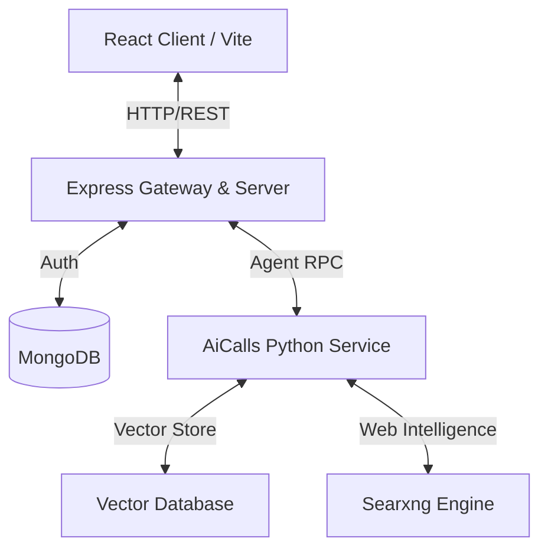

# AiChatBot: Multi-Agent Conversational AI Platform

An interviewer-ready, full-stack conversational AI platform featuring a multi-agent backend, Google OAuth authentication, administrative dashboards, and real-time streaming capabilities.

## 🚀 Architectural Overview



The system is split into three main components:
1. **Frontend**: A single-page application built using React, Vite, Tailwind CSS 4, and React Router. Highlights include full Google OAuth authentication flows, secure routing, markdown rendering with Github Flavored Markdown (GFM), and an Admin Dashboard.
2. **Backend**: An Express server written in TypeScript. It coordinates authentication, handles session state, interacts with MongoDB, and exposes APIs for conversation logging and user permissions.
3. **AiCalls Engine**: A high-performance Python microservice (managed by `uv`) that acts as the agentic brain. It manages scraping (`scrap_url.py`), vector searches (`vector_db_search.py`), and web searches using `searxng`.

---

## ✨ Key Features

* **Secure Authentication**: End-to-end user signup and login utilizing Google OAuth 2.0.
* **Agentic Tools**: Fully capable of executing web searches, vector database lookups, and URL scraping on the fly.
* **Admin Dashboard**: Manage user access, view chat activity logs, and provision new admins using utility CLI commands.
* **Modern CSS 4 Layout**: Beautiful modern layout styling built on top of Tailwind CSS v4.

---

## 🛠️ Tech Stack & Dependencies

* **Frontend**: React 19, TypeScript, Tailwind CSS v4, Vite, Axios, React Router, React Markdown, GFM.
* **Backend**: Node.js, Express, TypeScript, MongoDB (Mongoose), `dotenv`.
* **AI Core**: Python 3.12, Pyodide (client-side execution), FastAPI/Python routines, Searxng, HuggingFace models.

---

## 💻 Setup & Installation

### Prerequisites
- Docker & Docker Compose
- Node.js (v18+)
- Python 3.12 (with `uv` package manager recommended)

### Quick Start (Local Development)

1. **Configure Environment Variables**
   Create a `.env` file in the root directory:
   ```env
   PORT=3000
   MONGODB_URI=mongodb://localhost:27017/aichatbot
   GOOGLE_CLIENT_ID=your-google-client-id
   ```

2. **Run the AI Infrastructure**
   Launch background utilities (including Searxng) using Docker:
   ```bash
   docker compose -f docker-compose-utils.yaml up -d
   ```

3. **Start the Frontend**
   ```bash
   cd Frontend
   npm install
   npm run dev
   ```

4. **Start the Backend**
   ```bash
   cd Backend
   npm install
   npm run dev
   ```

5. **Start the AI Microservice**
   ```bash
   cd AiCalls
   uv run main.py
   ```

### Administrative Scripts
To grant admin privileges to a user, run:
```bash
npm run make-admin user@example.com
```
