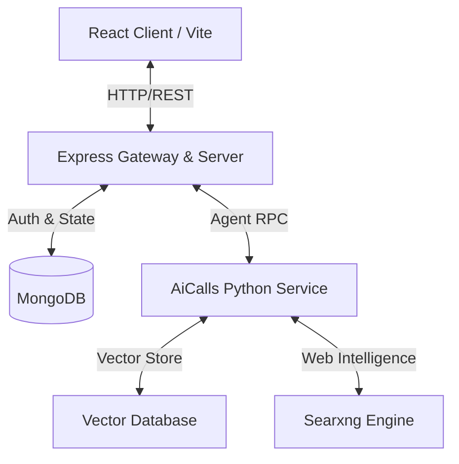

# AiChatBot: Multi-Agent Conversational AI Platform

An interviewer-ready, full-stack conversational AI platform featuring a multi-agent backend, Google OAuth authentication, administrative dashboards, and real-time streaming capabilities.

## 🚀 Architectural Overview



The system is split into three main components:

1. **Frontend**: A single-page application built using React, Vite, Tailwind CSS 4, and React Router. Highlights include full Google OAuth authentication flows, secure routing, markdown rendering with Github Flavored Markdown (GFM), and an Admin Dashboard.
2. **Backend**: An Express server written in TypeScript. It coordinates authentication, handles session state, interacts with MongoDB, and exposes APIs for conversation logging, user permissions, and AI-provider configuration.
3. **AiCalls Engine**: A high-performance Python microservice (managed by `uv`) that acts as the agentic brain. It manages scraping (`scrap_url.py`), vector searches (`vector_db_search.py`), and web searches using `searxng`.

> All environment defaults live in the root `.env.example`. Copy it to `.env` and fill in your secrets before starting.

---

## ✨ Key Features

* **Secure Authentication**: End-to-end user signup and login utilizing Google OAuth 2.0 (JWT session tokens backed by `JWT_SECRET` / `JWT_REFRESH_SECRET`).
* **Agentic Tools**: Fully capable of executing web searches, vector database lookups, and URL scraping on the fly.
* **Admin Dashboard**: Manage user access, view chat activity logs, provision admins, and configure AI providers — all from the protected `/admin` area.
* **AI Provider Configuration**: Administrators centrally manage AI providers (API keys, base URLs, tiers, and models) from **Admin → AI APIs**. Keys are encrypted at rest using `ENCRYPTION_KEY`. Every configuration route is authenticated (`authMiddleware`); admin-only endpoints additionally require `adminAuthMiddleware`. The backend gates AI requests and the frontend shows an actionable notice when no provider is enabled.
* **Modern CSS 4 Layout**: Beautiful modern layout styling built on top of Tailwind CSS v4.

---

## 🛠️ Tech Stack & Dependencies

* **Frontend**: React 19, TypeScript, Tailwind CSS v4, Vite, Axios, React Router, React Markdown, GFM.
* **Backend**: Node.js, Express, TypeScript, MongoDB (Mongoose), `dotenv`.
* **AI Core**: Python 3.12, Pyodide (client-side execution), FastAPI/Python routines, Searxng, HuggingFace models.

---

## 💻 Setup & Installation

### Prerequisites

- Docker & Docker Compose
- Node.js v18+
- Python 3.12 (`uv` recommended)

### Quick Start

1. **Configure environment** — copy the canonical example and edit secrets:
   ```bash
   cp .env.example .env
   # then edit .env: set JWT_SECRET, ENCRYPTION_KEY, MONGO_URI, GOOGLE_CLIENT_ID, AI_API, LLM API keys, etc.
   ```

2. **Run the AI infrastructure** (Qdrant, Searxng, Redis, Mongo, etc.):
   ```bash
   docker compose -f docker-compose-utils.yaml up -d
   ```

3. **Start everything from the repo root** (one command):
   ```bash
   npm run dev     # runs Frontend + Backend + AiCalls concurrently
   ```
   Or start pieces individually: `npm run server` (Frontend + Backend) and `npm run ai` (AiCalls only).

   Or go per-service:
   ```bash
   cd Frontend && npm install && npm run dev
   cd ../Backend && npm install && npm run dev
   cd ../AiCalls && uv run main.py --active
   ```

4. **Configure AI Providers (Admin)**
   Sign in as an admin, open **Admin → AI APIs**, and add at least one *enabled* provider (API key + base URL).
   > Before any provider is enabled, the chat shows **"AI APIs have not been configured yet."** and sends return a friendly `503` instead of a cryptic litellm failure.

   **Bulk-import providers from a local config file** (optional): paste your keys into the
   variables at the top of `AiCalls/tests/addapi.py`, then run the importer — it upserts
   every model into `aiproviders` and reloads the router, mirroring the admin panel:
   ```bash
   uv run --project AiCalls python AiCalls\tests\import_models.py
   ```

### Administrative Scripts

Admin privileges and user management are handled from the **Admin Dashboard**. There is no root-level `make-admin` CLI script in this repo.

---

## 🌐 API Routes (all mounted under `/api`)

| Route | Description |
|---|---|
| `login`, `logout`, `refresh`, `status` | OAuth / auth session endpoints |
| `chats`, `chats/:id` | Chat CRUD (create, list, fetch, branch) |
| `chats/:chatId/msgs` | Message CRUD + streaming send (`POST` opens an SSE stream) |
| `files`, `files/:id` | File upload / listing / deletion |
| `admin/users`, `admin/logs`, `admin/ai-providers`, … | Admin-only management (users, activity logs, AI provider config) |
| `user` | Authenticated user profile & settings |
| `config-status` | Authenticated provider-config probe (`GET /api/config-status`) |

> Sub-routes are mounted under `/api/admin/*` and are enforced by `adminAuthMiddleware` in addition to the global `authMiddleware`.

### Config Status API

`GET /api/config-status` is authenticated (`authMiddleware`) and returns:
```json
{ "configured": true, "enabledCount": 2, "providerCount": 3 }
```
No secrets are returned. The frontend polls this on chat open to decide whether to render the "AI APIs not configured" notice.
